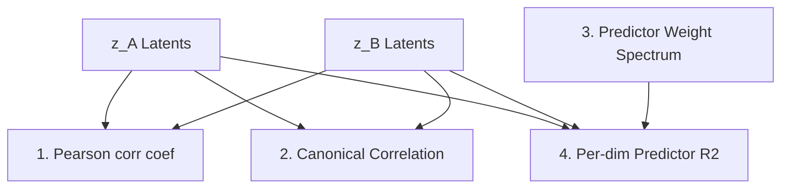

# Evaluation Design: Subspace Rank & Geometry Metrics

Theoretical AV benchmark dataset modes (like `nd-kf-mlp`) contain both shared mutual information factors and unique independent factors. This document outlines the mathematical formulation, sensitivity profiles, and interpretation rules for the **Found Common Rank Suite** and associated geometry metrics.

---

## 🏛️ The Found Common Rank Suite

The goal is to estimate $k_{\text{found}}$—the number of latent dimensions that the model allocates to the mutual-information (shared-factor) subspace.
* **Ground Truth:** $k_{\text{shared}}$ (e.g., $k=2$ for `3d-3f-2c` or `10d-10f-2c`, $k=5$ for `10d-10f-5c`).
* **Permutation Invariance:** Dims are unordered; we *count* active channels rather than assuming alignment in specific indices.

### 1. Per-Dim Pearson Correlation
Checks dimension-wise linear correlation across modalities without a predictor model.
* **Metric:** `geom/za_zb_pearson_dim{i}`
* **Rank Estimators:** `geom/found_rank_pearson_{1,3,5}` (Thresholds $\theta \in \{0.1, 0.3, 0.5\}$)
* **Math:**
  $$c_i = \text{Pearson}(z_{A,i}, z_{B,i}) = \frac{\text{Cov}(z_{A,i}, z_{B,i})}{\sigma(z_{A,i})\sigma(z_{B,i})}$$
  $$k_{\text{found}} = \sum_{i=1}^{d_{\text{out}}} \mathbb{I}(|c_i| > \theta)$$
* **Sensitivity Profile:** Requires explicit coordinate axis-alignment across $z_A$ and $z_B$. Underestimates rank if the shared subspace is rotated or mixed.

### 2. Canonical Correlation Analysis (CCA)
Identifies shared linear subspaces by finding optimal coordinate transformations.
* **Metric:** `geom/cca_corr_dim{i}`
* **Rank Estimators:** `geom/found_rank_cca_{1,3,5}` (Thresholds $\theta \in \{0.1, 0.3, 0.5\}$)
* **Math:** Singular values of the canonical cross-covariance matrix.
  $$k_{\text{found}} = \sum_{i=1}^{d_{\text{out}}} \mathbb{I}(\text{cca\_corr}_i > \theta)$$
* **Sensitivity Profile:** Rotation-invariant. Extremely robust at capturing the total linear dimensionality of the shared space, even if coordinate alignment is incomplete.

### 3. Predictor Weight Spectrum
Measures the scaling factor applied by the cross-modal predictive mapping.
* **Metric:** `geom/pred_w_dim{i}`
* **Rank Estimators:** `geom/found_rank_pred_w_{3,5,7}` (Thresholds $\theta \in \{0.3, 0.5, 0.7\}$)
* **Math:** For predictor $f(z_A) = W z_A + b$:
  $$k_{\text{found}} = \sum_{i=1}^{d_{\text{out}}} \mathbb{I}(|W_{ii}| > \theta)$$
* **Sensitivity Profile:** Only active for `AffinePredictor` or `DiagonalPredictor`. Directly tracks the L1 sparse loss ($\lambda_{\text{sparse}} \sum |W_{ii}|$) driving unpredicted unique dimension weights to zero.

### 4. Per-Dim Predictor $R^2$ on Clean Manifold Points
Calculates prediction quality exclusively on paired manifold points.
* **Metric:** `geom/pred_r2_dim{i}`
* **Rank Estimators:** `geom/found_rank_pred_r2_{1,3,5}` (Thresholds $\theta \in \{0.1, 0.3, 0.5\}$)
* **Math:** Evaluating only on clean samples ($pt_A = 0, pt_B = 0$):
  $$R^2_i = 1 - \frac{\sum (z_{B,\text{clean},i} - f(z_{A,\text{clean}})_i)^2}{\sum (z_{B,\text{clean},i} - \bar{z}_{B,\text{clean},i})^2}$$
  $$k_{\text{found}} = \sum_{i=1}^{d_{\text{out}}} \mathbb{I}(\max(0, R^2_i) > \theta)$$
* **Sensitivity Profile:** The most direct, noise-free assessment of alignment. High $R^2_i$ indicates that the $i$-th dimension of $z_B$ is actively predicted from $z_A$.

---

## ⚖️ Metric Comparison Matrix

| Estimator | Rotation Invariant? | Noise Robust? | Requires Predictor? | Primary Failure Mode |
| :--- | :---: | :---: | :---: | :--- |
| **Pearson** | ❌ No | ❌ Low | ✅ No | Subspace rotation / mixing |
| **CCA** | ✅ Yes | 🟡 Medium | ✅ No | Non-linear latent mappings |
| **Pred Weight** | ❌ No | ✅ High | ❌ Yes | Non-sparse predictor architectures |
| **Clean $R^2$** | ❌ No | ✅ High | ❌ Yes | Predictor underfitting |

---

## 📐 Manifold Flatness & Diagonality

### Diagonality Ratio
* **Metric:** `geom/za/diagonality_ratio`
* **Goal:** Measure how cleanly dimensions isolate individual factors.
* **Mechanism:** 
  1. Build $R^2$ matrix of dimensions against ground-truth factors $u_j$: $M_{i,j} = R^2(z_i, u_j)$.
  2. Select top-$k_{\text{shared}}$ dimensions by total $R^2$.
  3. Perform greedy optimal bipartite matching to maximize assigned $R^2$ sum.
  4. Ratio: $\text{assigned\_sum} / \text{total\_sum}$. A ratio of $1.0$ indicates perfect axis-alignment (each chosen dimension maps to exactly one factor).

> [!NOTE]
> The L1 prior (Laplace) shapes marginal distribution coordinate alignment, but it is the **L1 predictor sparse loss** ($\lambda_{\text{sparse}}$) that actively drives non-shared predictor weights to zero.

### Manifold Flatness
* **Metrics:** `geom/za/clean_flatness_ratio`, `geom/za/clean_orth_residual_mean`
* **Goal:** Verify that the manifold unrolls into a flat $k_{\text{shared}}$-dimensional hyperplane.
* **Math:** PCA is applied to the latents.
  * **Flatness Ratio:** Fraction of variance explained by the top $k_{\text{shared}}$ principal components.
  * **Orthogonal Residual:** Mean Euclidean distance of latent coordinates from the hyperplane spanned by these top $k_{\text{shared}}$ components.
